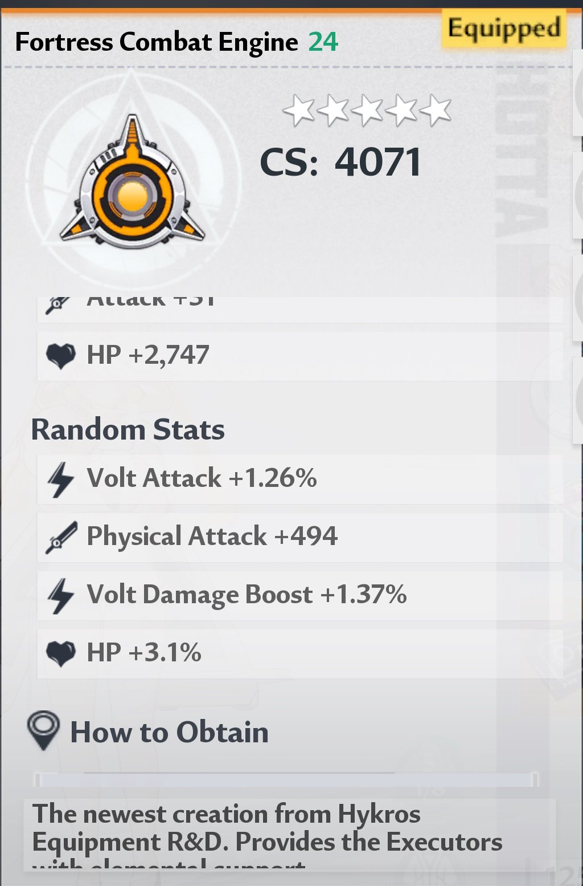

# ToF Equipment Rater Discord Bot

## Functional summary

- How to use it?
- Common errors

## Technical summary

- How to contribute?
- How to report a bug?
- About hosting
- TODO list

---

## How to use it?

First, you have to find the bot in discord by his name : `Lin - Equipment Rater`, then you can message it with `!rate` command and join your **SSR** equipment screenshot and the bot will enqueue your rate request and send you the results when your turn arrives. _(see: Queue system in About hosting)_

### Some prerequisites before posting your screenshot :

- Your game must be in compatible language for this bot : English or French
- Your game must be at least in resolution 1920x1080 before taking equipment screenshot
- Your screenshot must be one of these formats : .png, .jpg or .jpeg
- Your equipment **must be a SSR one** (Fortress equipment part)
- You must see on your screenshot the equipment part type (Fortress Sabatons, Fortress Armor, ...)
- You must see on your screenshot all 4 random stats as clear as possible

Here is an example of valid screenshot :


## Common errors

_WORK IN PROGRESS_

## How to contribute?

Before cloning this project, make sure you have this installed:
- Node.JS 16.x and NPM 8 or newer

Then clone this poject into your computer

Install npm dependencies with `npm i`

### About contributing:

You will not be able to run the bot locally without the `.env.local` file containing these informations :
```
BOT_TOKEN=<your_bot_token>
OWNER_ID=<your_discord_unique_id>
DEV_MODE=true
```

Don't forget to make a pull request with few commits and check if tests are still passing using `npm run tests`.

## How to report a bug?

To report a bug, please use the "bug" issue template and fill it as much as you can, and don't forget to join your screenshot, it's the most important.

## About hosting

Actually, the bot is hosted at Amazon Web Service on a "t2.small" EC2 instance, this is why it use a queue system for now.

## TODO list

- Configure AWS with github actions to auto-deploy the bot when push on master (I need help for that)
- Return more rate usage for parts and Vera parts
- Optimize stats recognition logic
- Throw better errors and send better error description to the user
- Add better log system
- Add TypeScript
